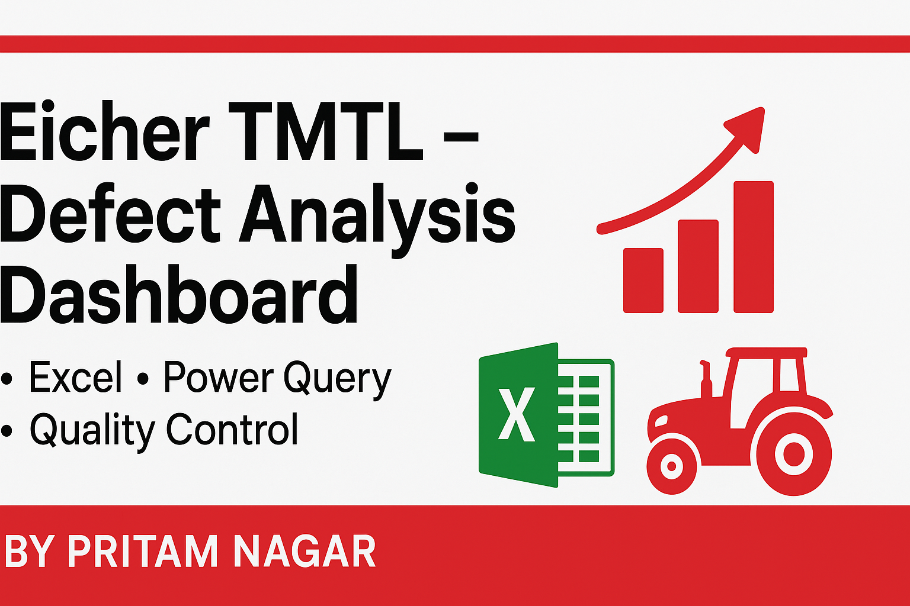
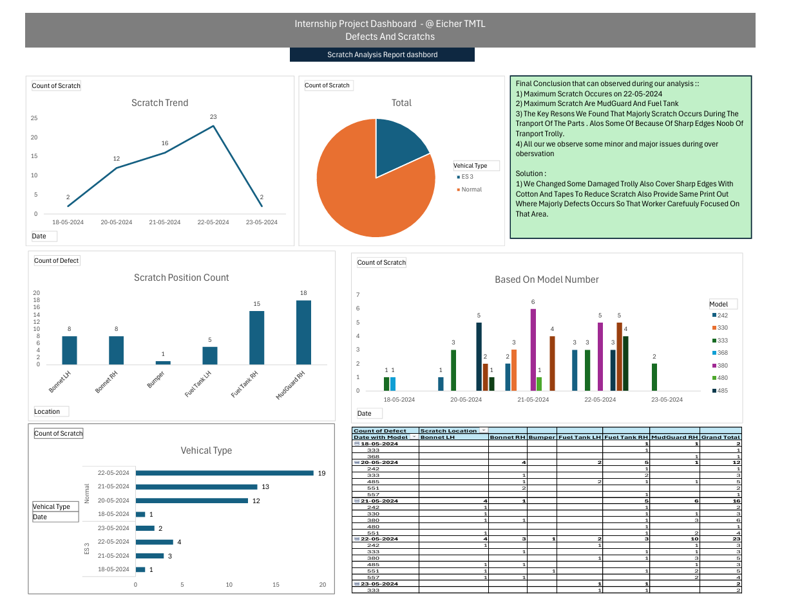
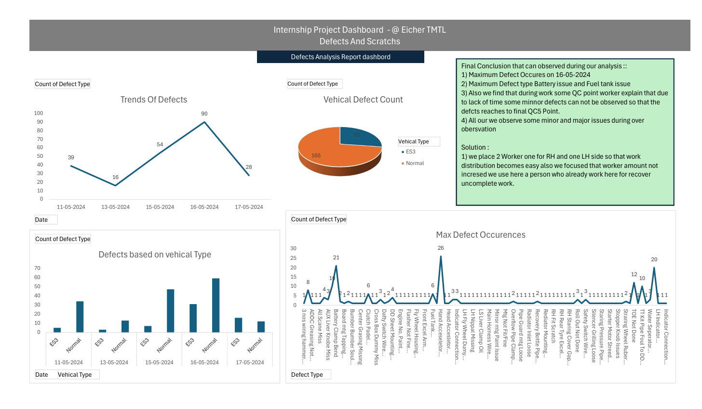

# Eicher TMTL – Defect Analysis Dashboard (Excel, Power Query)



**Role:** Production Intern – Eicher Tractors & Motors Limited (TMTL)  
**Duration:** May 2024 – June 2024 | **Location:** Bhopal, India  

A **data-driven defect and scratch analysis project** for tractor components (e.g., Model 380) using **Microsoft Excel** and **Power Query** to identify recurring defects, analyze root causes, and recommend preventive actions—ultimately improving manufacturing quality control.

---

## 🚀 Key Deliverables

### 📊 Interactive Dashboards


- Pareto analysis of top defects
- Scratch location heatmaps
- Real-time defect tracking

### 🔍 Root Cause Analysis
| Defect Type | Frequency | Primary Cause |
|-------------|-----------|---------------|
| Battery Box | 32% | Handling during transport |
| Fuel Tank | 28% | Packaging design |
| Accelerator | 18% | Assembly line process |

---


## 🚀 Project Highlights

- **Data Cleaning & Preparation** – Structured and standardized raw QA inspection data for reliable analysis.  
- **Interactive Excel Dashboards** – Designed visual dashboards to highlight recurring issues like battery box fitment, accelerator rubber misalignment, and fuel tank scratches.  
- **Root Cause Analysis** – Identified major contributors including mishandling during assembly, transport damage, and design/equipment flaws.  
- **Preventive Recommendations** – Suggested insulated packaging, rubber-padded kitting trolleys, and revised assembly & logistics SOPs.  
- **Management Reporting** – Delivered clear, actionable reports that improved QA efficiency and reduced rework incidents.

---

## 🛠 Skills & Tools
- **Microsoft Excel** – Pivot Tables, Charts, Conditional Formatting  
- **Power Query** – Data Cleaning & Transformation  
- **Data Visualization** – Interactive reporting for defect tracking  
- **Root Cause Analysis** – Manufacturing quality control  
- **Process Improvement** – Preventive measures & SOP updates  

---

## 📂 Files
- [📊 Final Defect Analysis Dashboard (Excel)](Final_Defect_Analysis_Project.xlsx)  
- [📄 Project Report (PDF)](Defects%20and%20Scratch%20(1).pdf)  

---

## 📌 How to View
1. Clone the repository:
   ```bash
   git clone https://github.com/Pritam9952/Data-Analysis-Project-Excel.git
   cd Data-Analysis-Project-Excel/Eicher_Tmtl_Traniee
